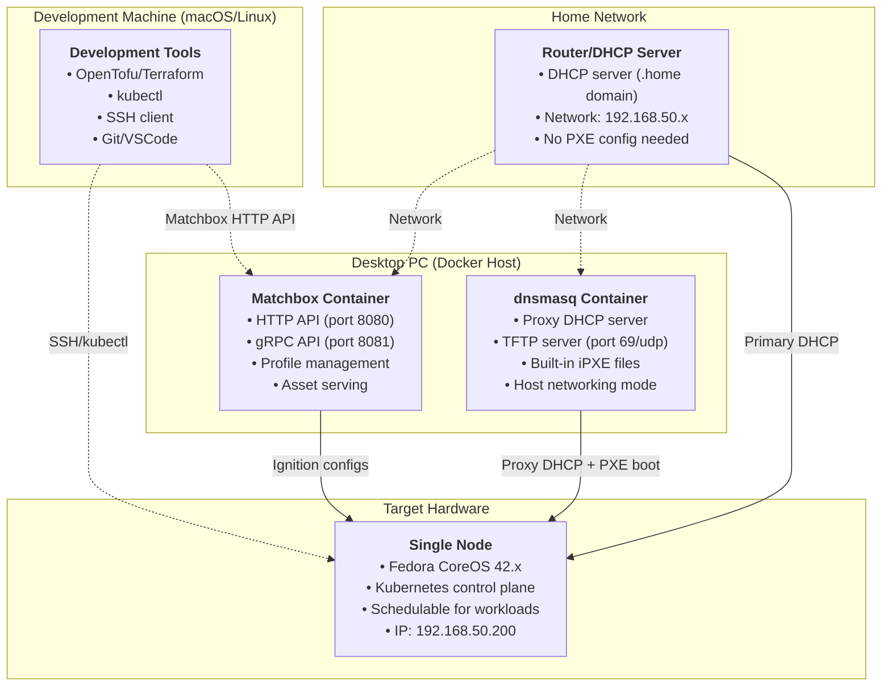
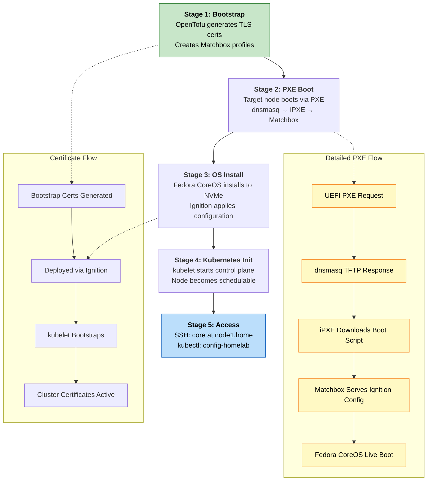

# Typhoon Homelab

A single-node Kubernetes homelab built with [Typhoon](https://typhoon.psdn.io/) using Fedora CoreOS, Matchbox for PXE provisioning, and infrastructure as code.

## Overview

This project implements a single-node bare-metal Kubernetes cluster using:

- [Typhoon](https://typhoon.psdn.io/) - Minimal, free Kubernetes distribution
- [Fedora CoreOS](https://fedoraproject.org/coreos/) - Container-optimized operating system
- [Matchbox](https://matchbox.psdn.io/) - Network boot and machine provisioning service
- [OpenTofu](https://opentofu.org/)/[Terraform](https://developer.hashicorp.com/terraform) - Infrastructure as code
- [Ignition](https://coreos.github.io/ignition/) - Declarative system configuration
- [Cilium](https://cilium.io/) or [Flannel](https://github.com/flannel-io/flannel) - Container networking (we use Cilium for reasons stated in [Networking Choice: Cilium vs Flannel](#networking-choice-cilium-vs-flannel))

## Architecture



## Deployment Workflow



## Key Features

- Single-Node Design: Controller node is schedulable for workloads, perfect for homelab environments
- Docker-Based Services: Matchbox and TFTP run in containers on your desktop PC
- Manual Control: No hidden automation - understand each step before proceeding
- Production Patterns: Uses official Typhoon modules and Fedora CoreOS best practices
- Expansion Ready: Easy path to add worker nodes when needed

## Networking Choice: Cilium vs Flannel

Typhoon supports both Cilium and Flannel CNI providers. This project defaults to **Cilium** for several reasons:

### Cilium (Default)
- eBPF-based: More efficient networking with lower CPU overhead
- Network Policies: Built-in security policies for pod-to-pod communication
- Observability: Better network visibility and monitoring capabilities
- Single-node Optimized: Better resource utilization for constrained environments
- Future-proof: Modern networking stack with ongoing development

### Flannel (Alternative)
- Simplicity: Easier to understand and troubleshoot
- Lightweight: Minimal resource footprint
- Mature: Well-tested, stable, widely deployed
- Learning-friendly: Simpler concepts for networking beginners

To use Flannel instead, change the `networking` variable in `terraform.tfvars`:
```hcl
networking = "flannel"
```

## Prerequisites

### Hardware Requirements
- Development Machine: macOS/Linux with OpenTofu/Terraform, kubectl, SSH
- Desktop PC: Linux machine with Docker for running Matchbox services
- Target Node: Single bare-metal server with 2GB+ RAM, 30GB+ disk, PXE-enabled NIC
- Network: Home router with DHCP and PXE boot capability

### Software Requirements
- Docker and Docker Compose on desktop PC
- OpenTofu or Terraform v1.0+ on development machine
- kubectl for cluster management
- SSH keys for machine access

## Quick Start

1. **Deploy Matchbox and dnsmasq Services on Desktop PC**
   ```bash
   cd docker/
   cp .env.example .env
   # Edit .env with your network settings
   ./generate-certs.sh
   docker compose --profile dnsmasq up -d
   ```

2. **Configure Infrastructure on Dev Machine**
   ```bash
   cd infrastructure/
   cp terraform.tfvars.example terraform.tfvars
   # Edit with your environment details
   ```

3. **Deploy Single-Node Cluster (Two-Step Process)**
   
   **Step 1: Pre-Node Setup** (safe without target node powered on)
   ```bash
   cd infrastructure
   tofu init
   tofu plan
   
   # Apply bootstrap components and Matchbox configurations
   tofu apply -target="module.homelab.module.bootstrap"
   tofu apply -target="module.homelab.matchbox_profile.controllers"  
   tofu apply -target="module.homelab.matchbox_group.controller"
   ```
   
   This creates:
   - All TLS certificates and Kubernetes PKI
   - Bootstrap tokens and cluster credentials
   - Matchbox profiles with Ignition configs
   - Matchbox groups (MAC address mappings)
   - PXE boot configurations
   
   **Step 2: Complete Deployment** (after target node is PXE booted and running)
   ```bash
   # After the node has successfully booted Fedora CoreOS and is SSH accessible
   tofu apply
   ```
   
   This creates the remaining resources:
   - `local_file.kubeconfig` - Your local kubeconfig file
   - `null_resource.bootstrap` - Cluster bootstrap process
   - `null_resource.copy-controller-secrets` - Copies secrets to node via SSH

4. **Power On Target Node with PXE Boot**
   ```bash
   # Set boot device to PXE and power on (manual or IPMI)
   ipmitool -H node1.home -U USER -P PASS chassis bootdev pxe
   ipmitool -H node1.home -U USER -P PASS power on
   ```

5. **Wait for Bootstrap and Verify Cluster**
   ```bash
   export KUBECONFIG=~/.kube/config-homelab
   kubectl get nodes
   kubectl get pods -A
   # Take time to manually inspect and understand your single-node cluster
   ```

## Directory Structure

```
├── README.md                    # This file
├── .gitignore                   # Git ignore patterns
├── certs/                       # TLS certificates (generated)
├── data/                        # Persistent data for services (generated)
│   ├── matchbox/                # Matchbox profiles, groups, machines
│   └── tftpboot/                # TFTP boot files (only if using separate TFTP server)
├── docker/                      # Docker Compose for Matchbox/dnsmasq
│   ├── docker-compose.yml       # Service definitions
│   ├── generate-certs.sh        # Certificate generation
│   ├── README.md                # Docker services documentation
│   └── .env.example             # Environment configuration
└── infrastructure/              # Terraform/OpenTofu configs
    ├── main.tf                  # Main cluster configuration
    ├── providers.tf             # Terraform providers and versions
    ├── variables.tf             # Variable definitions
    ├── outputs.tf               # Output values
    └── terraform.tfvars.example # Example configuration
```

## License

MIT License - see [LICENSE](LICENSE) file for details.

## References

- [Typhoon Documentation](https://typhoon.psdn.io/)
- [Fedora CoreOS](https://fedoraproject.org/coreos/)
- [Matchbox Project](https://github.com/poseidon/matchbox)
- [Ignition Specification](https://coreos.github.io/ignition/)
