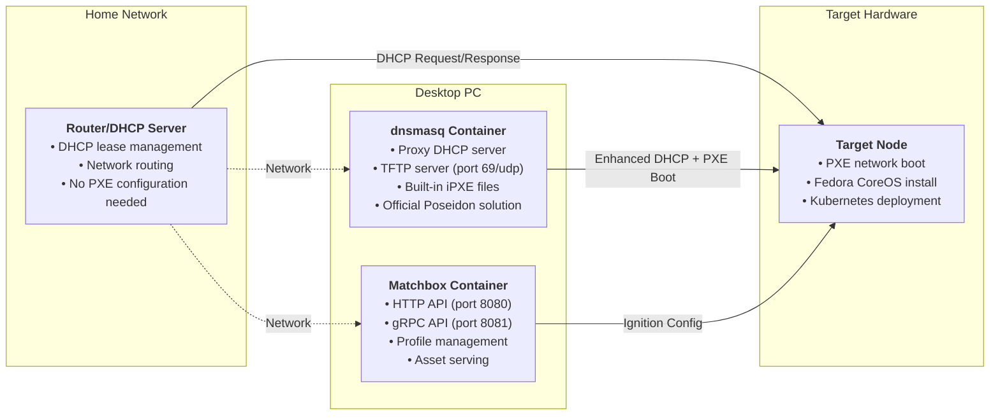

# Docker Compose for Typhoon Supporting Services

This directory contains Docker Compose configurations for running Matchbox and supporting PXE services on your desktop PC.

## Overview

The supporting services run on your desktop PC and provide:
- **Matchbox** - PXE boot and provisioning service
- **dnsmasq** - Official Poseidon proxy DHCP + TFTP server (for most home routers)

## Architecture



## dnsmasq: Official Poseidon Solution

The [poseidon/dnsmasq](https://quay.io/repository/poseidon/dnsmasq) container is the **official solution** from the Matchbox team for home networks. It combines proxy DHCP and TFTP services in a single, well-tested container.

### Why Use poseidon/dnsmasq?

- **Official Integration**: Designed specifically for Matchbox by the same team
- **Built-in iPXE Files**: Includes `undionly.kpxe`, `ipxe.efi`, and `grub.efi` automatically
- **Proxy DHCP Mode**: Works alongside your existing router DHCP without conflicts
- **Combined Services**: DHCP proxy + TFTP server in one container
- **Production Ready**: Used in official Matchbox documentation and examples

### How It Works

Instead of requiring separate DHCP proxy and TFTP containers, dnsmasq:
1. **Listens for DHCP requests** from PXE clients
2. **Provides proxy DHCP responses** with PXE boot options (without conflicting with your router)
3. **Serves iPXE files** via built-in TFTP server
4. **Chainloads to Matchbox** for Ignition configuration delivery

### Router Compatibility

| Router Type | Configuration Needed | dnsmasq Required |
|-------------|---------------------|------------------|
| **ASUS Consumer** (ZenWiFi, RT-series) | None | ✅ **Yes** |
| **Netgear Consumer** | None | ✅ **Yes** |
| **Linksys Consumer** | None | ✅ **Yes** |
| **Enterprise/Prosumer** | Manual DHCP options | ❌ Optional |
| **OpenWrt/pfSense** | Manual DHCP options | ❌ Optional |

## Quick Start

1. **Set up environment**
   ```bash
   cd docker/
   cp .env.example .env
   # Edit .env with your network settings
   ```

2. **Generate certificates**
   ```bash
   ./generate-certs.sh
   ```

3. **Start services (with dnsmasq for most home routers)**
   ```bash
   # For routers that need proxy DHCP (most home routers like ASUS ZenWiFi)
   docker-compose --profile dnsmasq up -d
   
   # For advanced routers with built-in PXE support (enterprise/OpenWrt)
   # docker-compose up -d  # Only Matchbox
   ```

4. **Verify services**
   ```bash
   docker-compose ps
   curl http://localhost:8080  # Should return "matchbox"
   ```

## Configuration

- Edit `.env` file for network settings
- Certificates are auto-generated in `../certs/` directory
- Matchbox data persists in `./data/` directory

## Network Requirements

### For Most Home Routers (dnsmasq Method)
Your setup needs:
1. **Desktop PC** with Docker and these services running
2. **Router DHCP** enabled (leave existing DHCP configuration alone)
3. **Network access** between desktop PC and target node
4. **Firewall rules** allowing traffic to ports 69/udp, 8080, 8081

**No router configuration changes needed** - dnsmasq handles PXE boot automatically using proxy DHCP.

### For Advanced Routers (Direct Configuration)
If your router supports custom DHCP options, you can run only Matchbox and configure:
1. **DHCP Option 66**: `192.168.50.100` (your desktop PC IP)
2. **DHCP Option 67**: `undionly.kpxe` (boot filename)
3. **TFTP Server**: Point to your desktop PC (you'll need a separate TFTP server)

## Services

### Matchbox
- **HTTP**: `http://desktop-ip:8080` (read-only)
- **gRPC**: `desktop-ip:8081` (API access)
- **Data**: Persisted in `./data/matchbox/`

### dnsmasq (when enabled)
- **Mode**: Host networking (direct network access)
- **DHCP**: Proxy DHCP mode (works alongside your router)
- **TFTP**: Built-in TFTP server on port 69/udp
- **iPXE Files**: `undionly.kpxe`, `ipxe.efi`, `grub.efi` included
- **Profile**: Only starts with `--profile dnsmasq` flag

## Maintenance

```bash
# View logs
docker-compose logs -f matchbox
docker-compose logs -f dnsmasq

# Restart services
docker-compose restart

# Update containers
docker-compose pull
docker-compose up -d

# Backup data
tar -czf backup-$(date +%Y%m%d).tar.gz data/ certs/
```
