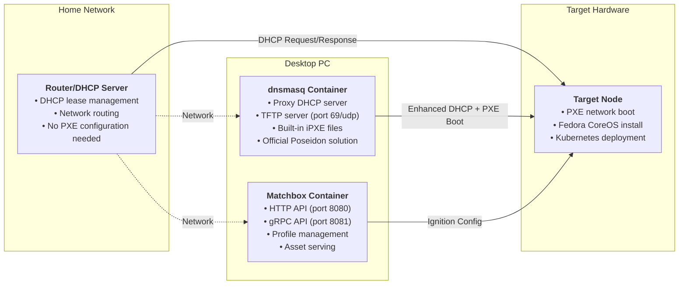

# Docker Compose for Typhoon Supporting Services

This directory contains Docker Compose configurations for running Matchbox and supporting PXE services on your desktop PC.

## Overview

The supporting services run on your desktop PC and provide:
- **Matchbox** - PXE boot and provisioning service
- **dnsmasq** - Official Poseidon proxy DHCP + TFTP server (for most home routers)

## Architecture



## dnsmasq: Official Poseidon Solution

The [poseidon/dnsmasq](https://quay.io/repository/poseidon/dnsmasq) container is the **official solution** from the Matchbox team for home networks. It combines proxy DHCP and TFTP services in a single, well-tested container.

### Why Use poseidon/dnsmasq?

- **Official Integration**: Designed specifically for Matchbox by the same team
- **Built-in iPXE Files**: Includes `undionly.kpxe`, `ipxe.efi`, and `grub.efi` automatically
- **Proxy DHCP Mode**: Works alongside your existing router DHCP without conflicts
- **Combined Services**: DHCP proxy + TFTP server in one container
- **Production Ready**: Used in official Matchbox documentation and examples

### How It Works

Instead of requiring separate DHCP proxy and TFTP containers, dnsmasq:
1. **Listens for DHCP requests** from PXE clients
2. **Provides proxy DHCP responses** with PXE boot options (without conflicting with your router)
3. **Serves iPXE files** via built-in TFTP server
4. **Chainloads to Matchbox** for Ignition configuration delivery

### Router Compatibility

| Router Type | dnsmasq Required | Configuration Needed |
|-------------|------------------|---------------------|
| **Most Home Routers** (ASUS, Netgear, Linksys) | ✅ **Yes** | None - works out of the box |
| **Enterprise/Advanced** (OpenWrt, pfSense) | ❌ Optional | Manual DHCP options 66 & 67 |

## Quick Start

1. **Set up environment**
   ```bash
   cd docker/
   cp .env.example .env
   # Edit .env with your network settings
   ```

2. **Generate certificates**
   ```bash
   ./generate-certs.sh
   ```

3. **Start services (with dnsmasq for most home routers)**
   ```bash
   # For routers that need proxy DHCP (most home routers like ASUS ZenWiFi)
   docker compose --profile dnsmasq up -d
   
   # For advanced routers with built-in PXE support (enterprise/OpenWrt)
   # docker compose up -d  # Only Matchbox
   ```

4. **Verify services**
   ```bash
   docker compose ps
   curl http://localhost:8080  # Should return "matchbox"
   ```

## Configuration

- Edit `.env` file for network settings
- Certificates are auto-generated in `../certs/` directory
- Matchbox data persists in `./data/` directory

## Network Requirements

### For Most Home Routers (dnsmasq Method)
Your setup needs:
1. **Desktop PC** with Docker and these services running
2. **Router DHCP** enabled (leave existing DHCP configuration alone)
3. **Network access** between desktop PC and target node
4. **Firewall rules** allowing traffic to ports 69/udp, 8080, 8081

**No router configuration changes needed** - dnsmasq handles PXE boot automatically using proxy DHCP.

### For Advanced Routers (Direct Configuration)
If your router supports custom DHCP options, you can run only Matchbox and configure:
1. **DHCP Option 66**: `192.168.50.100` (your desktop PC IP)
2. **DHCP Option 67**: `undionly.kpxe` (boot filename)
3. **TFTP Server**: Point to your desktop PC (you'll need a separate TFTP server)

## Services

### Matchbox
- **HTTP**: `http://desktop-ip:8080` (read-only)
- **gRPC**: `desktop-ip:8081` (API access)
- **Data**: Persisted in `./data/matchbox/`

### dnsmasq (when enabled)
- **Mode**: Host networking (direct network access)
- **DHCP**: Proxy DHCP mode (works alongside your router)
- **TFTP**: Built-in TFTP server on port 69/udp
- **iPXE Files**: `undionly.kpxe`, `ipxe.efi`, `grub.efi` included
- **Profile**: Only starts with `--profile dnsmasq` flag

## Maintenance

```bash
# View logs
docker compose logs -f matchbox
docker compose logs -f dnsmasq

# Restart services
docker compose restart

# Update containers
docker compose pull
docker compose up -d

# Backup data
tar -czf backup-$(date +%Y%m%d).tar.gz data/ certs/
```

---

## Appendix: Command Line Flags Reference

### Matchbox Service Flags

The Matchbox service is configured with the following command line flags in `docker-compose.yml`:

```bash
-address=0.0.0.0:8080
-rpc-address=0.0.0.0:8081
-data-path=/var/lib/matchbox
-assets-path=/var/lib/matchbox/assets
-cert-file=/etc/matchbox/server.crt
-key-file=/etc/matchbox/server.key
-ca-file=/etc/matchbox/ca.crt
-log-level=info
```

**Flag Explanations:**

| Flag | Purpose | Description |
|------|---------|-------------|
| `-address` | HTTP API | Binds to all interfaces on port 8080. Serves boot configurations, ignition files, and assets to PXE booting machines |
| `-rpc-address` | gRPC API | gRPC API endpoint on port 8081 used by the `matchbox` CLI tool to manage profiles, groups, and machines |
| `-data-path` | Data Storage | Path to data directory where matchbox stores configuration data (profiles, groups, machine definitions) |
| `-assets-path` | Asset Storage | Path to static assets directory for Linux kernels, initrd images, and other boot assets |
| `-cert-file` | TLS Certificate | Server TLS certificate file for secure HTTPS communications |
| `-key-file` | TLS Private Key | Server TLS private key file |
| `-ca-file` | Certificate Authority | CA certificate to verify and authenticate client certificates |
| `-log-level` | Logging | Set logging level - options: `debug`, `info`, `warn`, `error` (default: `info`) |

### dnsmasq Service Flags

The dnsmasq service is configured with the following command line flags:

```bash
-d -q
--port=0
--dhcp-range=192.168.50.1,proxy,255.255.255.0
--enable-tftp
--tftp-root=/var/lib/tftpboot
--dhcp-userclass=set:ipxe,iPXE
--pxe-service=tag:#ipxe,x86PC,"PXE chainload to iPXE",undionly.kpxe
--pxe-service=tag:ipxe,x86PC,"iPXE",http://192.168.50.100:8080/boot.ipxe
--pxe-service=tag:#ipxe,X86-64_EFI,"PXE chainload to iPXE UEFI",ipxe.efi
--pxe-service=tag:ipxe,X86-64_EFI,"iPXE UEFI",http://192.168.50.100:8080/boot.ipxe
--address=/matchbox.home/192.168.50.100
--log-queries
--log-dhcp
```

**Flag Explanations:**

| Flag | Purpose | Description |
|------|---------|-------------|
| `-d` | Container Mode | Do NOT fork into the background - run in foreground mode (required for containers) |
| `-q` | DNS Logging | Log DNS queries for debugging |
| `--port=0` | DNS Disable | Disable DNS server functionality (port 53) - we only want DHCP proxy and TFTP services |
| `--dhcp-range` | DHCP Proxy | Enable DHCP in proxy mode for the specified network range |
| `--enable-tftp` | TFTP Server | Enable the integrated read-only TFTP server for serving boot files |
| `--tftp-root` | TFTP Directory | Set the root directory for TFTP file serving |
| `--dhcp-userclass` | iPXE Detection | Map DHCP user class to tag - identifies iPXE clients |
| `--pxe-service` | Boot Services | Define PXE boot services for different client types (BIOS/UEFI) |
| `--address` | DNS Resolution | Return specific IP address for DNS queries to `matchbox.home` domain |
| `--log-queries` | Query Logging | Log all DNS queries for debugging |
| `--log-dhcp` | DHCP Logging | Log all DHCP transactions for debugging |

**PXE Service Details:**
- **First service**: Initial PXE boot loads iPXE bootloader (`undionly.kpxe` or `ipxe.efi`)
- **Second service**: iPXE clients get directed to Matchbox for boot configuration

### Common dnsmasq Options

For reference, here are other commonly used dnsmasq options that could be useful:

- **`--dhcp-boot`**: Specify BOOTP options (alternative to `--pxe-service`)
- **`--dhcp-option`**: Send specific DHCP options to clients
- **`--interface`**: Specify which network interface(s) to listen on
- **`--bind-interfaces`**: Bind only to interfaces in use (security)
- **`--no-hosts`**: Don't load `/etc/hosts` file
- **`--cache-size`**: Set DNS cache size (default: 150 entries)
- **`--dhcp-authoritative`**: Assume we are the only DHCP server (use with caution)
- **`--dhcp-leasefile`**: Specify where to store DHCP leases

### Debugging Commands

To see all available options for each service:

```bash
# Matchbox help
docker exec matchbox /matchbox -help

# dnsmasq help  
docker exec dnsmasq dnsmasq --help

# dnsmasq DHCP-specific help
docker exec dnsmasq dnsmasq --help dhcp
```
