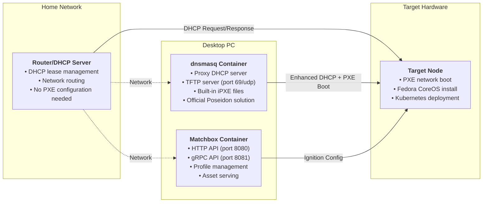

# Matchbox & PXE Boot Services

This directory contains Docker Compose services for [Matchbox](https://matchbox.psdn.io/) and [dnsmasq](https://thekelleys.org.uk/dnsmasq/doc.html) to enable PXE/iPXE network booting of Fedora CoreOS nodes for Typhoon-based Kubernetes clusters.
## Directory Structure

```
├── docker-compose.yml       # Service definitions
├── generate-certs.sh        # Certificate generation script
├── .env.example            # Environment configuration example
├── certs/                  # TLS certificates (generated)
├── data/
│   └── matchbox/           # Matchbox profiles, groups, assets, ignition
└── README.md               # This file

```
## Quick Start

1. **Copy and edit environment file:**
   ```bash
   cp .env.example .env
   # Edit .env with your network and cluster settings
   ```

2. **Generate TLS certificates:**
   ```bash
   ./generate-certs.sh
   # Certificates will be placed in ./certs
   ```

3. **Start Matchbox and dnsmasq:**
   ```bash
   docker compose --profile dnsmasq up -d
   ```
4. **PXE Boot Target Node:**

   - Set the target node to PXE/network boot and power it on (manual or IPMI).
   - When the iPXE prompt appears, press `Ctrl+B` to enter the iPXE shell.
   - At the `iPXE>` prompt, run:
     ```
     dhcp
     chain http://<matchbox-ip>:8080/boot.ipxe
     ```
   - The node will continue booting and install Fedora CoreOS.

## Troubleshooting
- If the node stalls at the iPXE prompt or shows "Network unreachable", enter the iPXE shell (Ctrl+B) and run:
  ```
  dhcp
  chain http://<matchbox-ip>:8080/boot.ipxe
  ```
- See the main repo README for more PXE/iPXE troubleshooting tips and the full deployment workflow.

## Notes
- The `data/matchbox/` directory is mounted for persistent Matchbox state (profiles, groups, assets).
- The `certs/` directory is mounted for Matchbox gRPC and HTTPs endpoints.
- The `dnsmasq` service is configured as a proxy DHCP and TFTP server for chainloading iPXE.
- See the main repo README for full infrastructure deployment steps.

> [!IMPORTANT]
> Always use TLS for Matchbox API endpoints. Certificates are generated by `generate-certs.sh`.

> [!TIP]
> You can run only Matchbox (without dnsmasq) using: `docker compose up matchbox -d`
# Docker Compose for Typhoon Supporting Services

This directory contains Docker Compose configurations for running Matchbox and supporting PXE services on your desktop PC. The setup uses two containerized services: **Matchbox** for PXE boot provisioning and **dnsmasq** as the official Poseidon proxy DHCP + TFTP server for home networks.

## Architecture



## dnsmasq: The Official Solution

The [poseidon/dnsmasq](https://quay.io/repository/poseidon/dnsmasq) container is the **official solution** provided by the Matchbox team for environments without enterprise-grade network infrastructure. It combines proxy DHCP and TFTP services in a single container that works alongside your existing router without conflicts.

This container includes built-in iPXE files (`undionly.kpxe`, `ipxe.efi`, `grub.efi`) and operates in proxy DHCP mode, meaning it enhances your router's DHCP responses with PXE boot information without interfering with IP address assignment.

**Key Benefits:**
- Zero router configuration - works with consumer routers (ASUS, Netgear, Linksys) that lack PXE boot support
- Production-tested - used in official Matchbox documentation and real deployments  
- Built-in boot files - no need to manage iPXE binaries separately
- Proxy DHCP design - coexists peacefully with your existing DHCP server

> [!WARNING]
> Never mount a volume over `/var/lib/tftpboot` as this masks the container's built-in iPXE files with empty directories, breaking PXE boot.

## Quick Start

1. **Environment Setup**
   ```bash
   cd docker/
   cp .env.example .env
   # Edit .env with your network settings (DESKTOP_IP, TARGET_NODE_MAC, etc.)
   ```

2. **Generate TLS Certificates**
   ```bash
   ./generate-certs.sh
   ```

3. **Start Services**
   ```bash
   # For most home routers (ASUS, Netgear, Linksys, etc.)
   docker compose --profile dnsmasq up -d
   
   # For enterprise routers with built-in PXE support (optional)
   # docker compose up -d  # Matchbox only
   ```

4. **Verify Everything is Running**
   ```bash
   docker compose ps
   curl http://localhost:8080  # Should return "matchbox"
   ```

## Network Requirements and Router Compatibility

**Most Home Routers (Recommended Setup)**
Use the dnsmasq container for ASUS, Netgear, Linksys, and similar consumer routers. No router configuration changes are needed - dnsmasq operates in proxy DHCP mode, enhancing your existing DHCP server with PXE boot capabilities.

Requirements:
- Desktop PC with Docker running these services
- Existing router DHCP enabled (leave current settings unchanged)
- Network connectivity between desktop PC and target node
- Firewall allowing ports 69/udp, 8080, and 8081

**Enterprise/Advanced Routers (Alternative Setup)**
For routers with custom DHCP options (OpenWrt, pfSense, enterprise gear), you can run only Matchbox and configure DHCP options directly:
- DHCP Option 66: `192.168.50.100` (desktop PC IP)
- DHCP Option 67: `undionly.kpxe` (boot filename)
- Requires separate TFTP server setup

## Service Details

**Matchbox**
- HTTP API (port 8080): Read-only endpoint serving Ignition configs, boot files, and static assets to target nodes
- gRPC API (port 8081): Management endpoint used by OpenTofu/Terraform for creating profiles and groups
- Data Persistence: Configuration and assets stored in `../data/matchbox/` via bind mount
- TLS Security: Uses generated certificates from `../certs/` for secure communications

**dnsmasq** (when using `--profile dnsmasq`)
- Host Networking: Direct network access required for DHCP proxy functionality
- Proxy DHCP: Enhances router DHCP responses with PXE boot options without IP conflicts
- Built-in TFTP: Serves iPXE boot files (`undionly.kpxe`, `ipxe.efi`) on port 69/udp
- Boot Chain: Initial PXE → iPXE bootloader → Matchbox for Ignition configs

## Maintenance and Troubleshooting

**Common Operations**
```bash
# Monitor service logs
docker compose logs -f matchbox
docker compose logs -f dnsmasq

# Restart services
docker compose restart

# Update to latest images
docker compose pull && docker compose up -d

# Backup configuration and certificates
tar -czf homelab-backup-$(date +%Y%m%d).tar.gz ../data/ ../certs/
```

**Configuration Files**
- Environment variables: Edit `.env` for network settings and target node information
- TLS certificates: Auto-generated in `../certs/` - regenerate with `./generate-certs.sh` if needed
- Matchbox data: Profiles, groups, and assets persist in `../data/matchbox/`

---

## Appendix: Command Line Flags Reference

### Matchbox Service Flags

The Matchbox service is configured with the following command line flags in `docker-compose.yml`:

```bash
-address=0.0.0.0:8080
-rpc-address=0.0.0.0:8081
-data-path=/var/lib/matchbox
-assets-path=/var/lib/matchbox/assets
-cert-file=/etc/matchbox/server.crt
-key-file=/etc/matchbox/server.key
-ca-file=/etc/matchbox/ca.crt
-log-level=info
```

**Flag Explanations:**

| Flag | Purpose | Description |
|------|---------|-------------|
| `-address` | HTTP API | Binds to all interfaces on port 8080. Serves boot configurations, ignition files, and assets to PXE booting machines |
| `-rpc-address` | gRPC API | gRPC API endpoint on port 8081 used by the `matchbox` CLI tool to manage profiles, groups, and machines |
| `-data-path` | Data Storage | Path to data directory where matchbox stores configuration data (profiles, groups, machine definitions) |
| `-assets-path` | Asset Storage | Path to static assets directory for Linux kernels, initrd images, and other boot assets |
| `-cert-file` | TLS Certificate | Server TLS certificate file for secure HTTPS communications |
| `-key-file` | TLS Private Key | Server TLS private key file |
| `-ca-file` | Certificate Authority | CA certificate to verify and authenticate client certificates |
| `-log-level` | Logging | Set logging level - options: `debug`, `info`, `warn`, `error` (default: `info`) |

### dnsmasq Service Flags

The dnsmasq service is configured with the following command line flags:

```bash
-d -q
--port=0
--dhcp-range=192.168.50.1,proxy,255.255.255.0
--enable-tftp
--tftp-root=/var/lib/tftpboot
--dhcp-userclass=set:ipxe,iPXE
--pxe-service=tag:#ipxe,x86PC,"PXE chainload to iPXE",undionly.kpxe
--pxe-service=tag:ipxe,x86PC,"iPXE",http://192.168.50.100:8080/boot.ipxe
--pxe-service=tag:#ipxe,X86-64_EFI,"PXE chainload to iPXE UEFI",ipxe.efi
--pxe-service=tag:ipxe,X86-64_EFI,"iPXE UEFI",http://192.168.50.100:8080/boot.ipxe
--address=/matchbox.home/192.168.50.100
--log-queries
--log-dhcp
```

**Flag Explanations:**

| Flag | Purpose | Description |
|------|---------|-------------|
| `-d` | Container Mode | Do NOT fork into the background - run in foreground mode (required for containers) |
| `-q` | DNS Logging | Log DNS queries for debugging |
| `--port=0` | DNS Disable | Disable DNS server functionality (port 53) - we only want DHCP proxy and TFTP services |
| `--dhcp-range` | DHCP Proxy | Enable DHCP in proxy mode for the specified network range |
| `--enable-tftp` | TFTP Server | Enable the integrated read-only TFTP server for serving boot files |
| `--tftp-root` | TFTP Directory | Set the root directory for TFTP file serving |
| `--dhcp-userclass` | iPXE Detection | Map DHCP user class to tag - identifies iPXE clients |
| `--pxe-service` | Boot Services | Define PXE boot services for different client types (BIOS/UEFI) |
| `--address` | DNS Resolution | Return specific IP address for DNS queries to `matchbox.home` domain |
| `--log-queries` | Query Logging | Log all DNS queries for debugging |
| `--log-dhcp` | DHCP Logging | Log all DHCP transactions for debugging |

**PXE Service Details:**
- First service: Initial PXE boot loads iPXE bootloader (`undionly.kpxe` or `ipxe.efi`)
- Second service: iPXE clients get directed to Matchbox for boot configuration

### Common dnsmasq Options

For reference, here are other commonly used dnsmasq options that could be useful:

- `--dhcp-boot`: Specify BOOTP options (alternative to `--pxe-service`)
- `--dhcp-option`: Send specific DHCP options to clients
- `--interface`: Specify which network interface(s) to listen on
- `--bind-interfaces`: Bind only to interfaces in use (security)
- `--no-hosts`: Don't load `/etc/hosts` file
- `--cache-size`: Set DNS cache size (default: 150 entries)
- `--dhcp-authoritative`: Assume we are the only DHCP server (use with caution)
- `--dhcp-leasefile`: Specify where to store DHCP leases

### Debugging Commands

To see all available options for each service:

```bash
# Matchbox help
docker exec matchbox /matchbox -help

# dnsmasq help  
docker exec dnsmasq dnsmasq --help

# dnsmasq DHCP-specific help
docker exec dnsmasq dnsmasq --help dhcp
```
